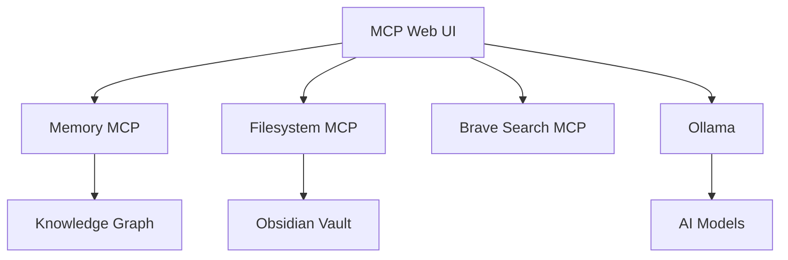

# System Overview

## Components

### MCP Servers
- **Memory MCP**: Stores knowledge graph information
- **Filesystem MCP**: Provides access to files and directories
- **Brave Search MCP**: Enables web search capabilities

### Ollama Integration
- Models: llama3.1:8b, dolphin-mistral:7b, NeuralDaredevil-8B-abliterated

### Obsidian Vault
- Structured knowledge storage
- Template-based note creation
- Integrated with MCP for RAG capabilities

## Architecture

## Edit History

| Date | Time | Edit | Author |
| ---- | ---- | ---- | ------ |
| 2025-03-07 | 12:45 | Initial creation | Claude |
