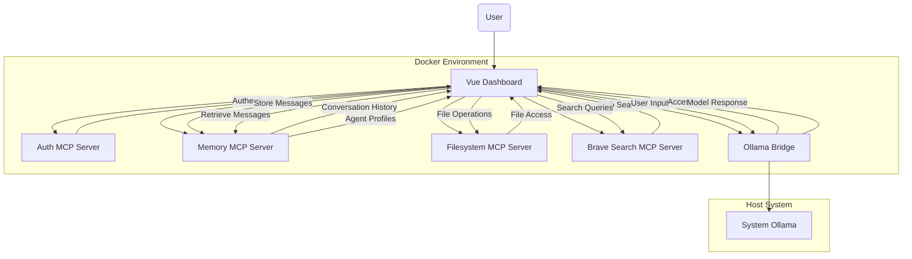

# MCP System Architecture

This document provides an overview of the Model Context Protocol (MCP) system architecture used in the Mukka platform.

## System Overview

The Mukka platform uses a microservices architecture based on the Model Context Protocol (MCP) to provide a flexible and extensible AI chat interface. The system consists of several specialized services that work together to provide a complete solution.

## Architecture Diagram

## Components

### 1. Vue Dashboard (Primary UI)

- **URL**: http://localhost:3002
- **Description**: The main user interface for interacting with the system. Built with Vue.js and provides access to all MCP services.
- **Key Functions**:
  - User authentication
  - Chat interface
  - Agent management
  - File browsing
  - Web search
  - Settings management

### 2. Auth MCP Server

- **URL**: http://localhost:8097
- **Description**: Handles user authentication and authorization.
- **Key Functions**:
  - User login/logout
  - Profile management
  - Token verification
  - User permissions

### 3. Memory MCP Server

- **URL**: http://localhost:8094
- **Description**: Manages conversation history and agent profiles.
- **Key Functions**:
  - Store and retrieve conversations
  - Manage messages
  - Store agent configurations
  - Conversation context management

### 4. Filesystem MCP Server

- **URL**: http://localhost:8095
- **Description**: Provides access to the file system for document storage and retrieval.
- **Key Functions**:
  - List directories
  - Read files
  - Write files
  - Delete files

### 5. Brave Search MCP Server

- **URL**: http://localhost:8096
- **Description**: Provides web search capabilities using the Brave Search API.
- **Key Functions**:
  - Web search queries
  - Local search (if configured)
  - Search suggestions

### 6. Ollama Bridge

- **URL**: http://localhost:8082
- **Description**: Provides a standardized interface to the Ollama local LLM service.
- **Key Functions**:
  - List available models
  - Execute model queries
  - Streaming responses
  - Parameter configuration

### 7. System Ollama

- **URL**: http://localhost:11434
- **Description**: Local LLM service running on the host machine (not containerized).
- **Key Functions**:
  - LLM model hosting
  - Inference execution
  - Model management

## Communication Flow

1. User interacts with the Vue Dashboard in their browser
2. Vue Dashboard authenticates the user through the Auth MCP Server
3. User selects or creates an agent using the Memory MCP Server
4. User starts a conversation:
   - Messages are sent to the Ollama Bridge for LLM processing
   - Responses are returned to the Vue Dashboard
   - Conversation history is stored in the Memory MCP Server
5. Additional capabilities:
   - File browsing and management via Filesystem MCP Server
   - Web search via Brave Search MCP Server

## Network Configuration

All services expose HTTP APIs on their designated ports:

- Vue Dashboard: 3002
- Auth MCP Server: 8097
- Memory MCP Server: 8094
- Filesystem MCP Server: 8095
- Brave Search MCP Server: 8096
- Ollama Bridge: 8082
- System Ollama: 11434

## Data Persistence

- Memory MCP Server: Stores data in a volume mounted at `/data`
- Auth MCP Server: Stores user data in a volume mounted at `/data/auth.json`
- Filesystem MCP Server: Accesses the host filesystem through a mounted volume

## Deployment

The system is deployed using Docker Compose, which manages the containerization and networking of all MCP services. The Ollama service runs directly on the host system rather than in a container to avoid port conflicts.

## Security Considerations

- Authentication is handled through the Auth MCP Server using JWT tokens
- Services use HTTP by default; in production, HTTPS should be configured
- All services should have proper authentication for production use
- The Filesystem MCP Server has access to host directories, which should be properly restricted
