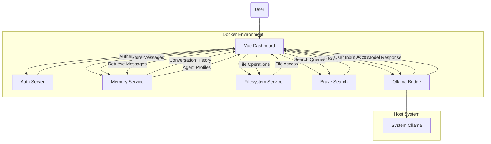

# MukkaAI System Architecture

This document provides an overview of the MukkaAI system architecture.

## Version History

| Version | Date | Author | Changes |
|---------|------|--------|---------|
| 1.0 | 2025-03-09 | Documentation Team | Initial document with MukkaAI branding, renamed from MCP System Architecture |
| 1.1 | 2025-03-09 | Documentation Team | Added version history, updated formatting, clarified container naming |

## System Overview

The MukkaAI platform uses a microservices architecture to provide a flexible and extensible AI chat interface. The system consists of several specialized services that work together to provide a complete solution.

> **Note on Naming**: While this document uses "MukkaAI" branding, the underlying Docker containers and environment variables still use "MCP" in their names as part of the transition process.

## Architecture Diagram

## Components

### 1. Vue Dashboard (Primary UI)

- **URL**: http://localhost:3002
- **Container Name**: `mukka-vue-dashboard`
- **Description**: The main user interface for interacting with the system. Built with Vue.js and provides access to all MukkaAI services.
- **Key Functions**:
  - User authentication
  - Chat interface
  - Agent management
  - File browsing
  - Web search
  - Settings management

### 2. Auth Server

- **URL**: http://localhost:8097
- **Container Name**: `mukka-mcp-auth-server`
- **Description**: Handles user authentication and authorization.
- **Key Functions**:
  - User login/logout
  - Profile management
  - Token verification
  - User permissions

### 3. Memory Service

- **URL**: http://localhost:8094
- **Container Name**: `mukka-mcp-memory-server`
- **Description**: Manages conversation history and agent profiles.
- **Key Functions**:
  - Store and retrieve conversations
  - Manage messages
  - Store agent configurations
  - Conversation context management

### 4. Filesystem Service

- **URL**: http://localhost:8095
- **Container Name**: `mukka-mcp-filesystem-server`
- **Description**: Provides access to the file system for document storage and retrieval.
- **Key Functions**:
  - List directories
  - Read files
  - Write files
  - Delete files

### 5. Brave Search

- **URL**: http://localhost:8096
- **Container Name**: `mukka-mcp-brave-search-server`
- **Description**: Provides web search capabilities using the Brave Search API.
- **Key Functions**:
  - Web search queries
  - Local search (if configured)
  - Search suggestions

### 6. Ollama Bridge

- **URL**: http://localhost:8082
- **Container Name**: `mukka-mcp-ollama-bridge`
- **Description**: Provides a standardized interface to the Ollama local LLM service.
- **Key Functions**:
  - List available models
  - Execute model queries
  - Streaming responses
  - Parameter configuration

### 7. System Ollama

- **URL**: http://localhost:11434
- **Description**: Local LLM service running on the host machine (not containerized).
- **Key Functions**:
  - LLM model hosting
  - Inference execution
  - Model management

## Communication Flow

1. User interacts with the Vue Dashboard in their browser
2. Vue Dashboard authenticates the user through the Auth Server
3. User selects or creates an agent using the Memory Service
4. User starts a conversation:
   - Messages are sent to the Ollama Bridge for LLM processing
   - Responses are returned to the Vue Dashboard
   - Conversation history is stored in the Memory Service
5. Additional capabilities:
   - File browsing and management via Filesystem Service
   - Web search via Brave Search

## Network Configuration

All services expose HTTP APIs on their designated ports:

| Service | Port | Container Name |
|---------|------|---------------|
| Vue Dashboard | 3002 | `mukka-vue-dashboard` |
| Auth Server | 8097 | `mukka-mcp-auth-server` |
| Memory Service | 8094 | `mukka-mcp-memory-server` |
| Filesystem Service | 8095 | `mukka-mcp-filesystem-server` |
| Brave Search | 8096 | `mukka-mcp-brave-search-server` |
| Ollama Bridge | 8082 | `mukka-mcp-ollama-bridge` |
| System Ollama | 11434 | (Host system service) |

## Data Persistence

- Memory Service: Stores data in a volume mounted at `/data`
- Auth Server: Stores user data in a volume mounted at `/data/auth.json`
- Filesystem Service: Accesses the host filesystem through a mounted volume

## Deployment

The system is deployed using Docker Compose, which manages the containerization and networking of all services. The Ollama service runs directly on the host system rather than in a container to avoid port conflicts.

For detailed deployment instructions, see the [MukkaAI Deployment Guide](/home/mothership/mukka/rag/mukka_vault/01-System/MCP_Deployment_Guide.md).

For environment variable configuration, see the [Environment Variables Configuration](/home/mothership/mukka/rag/mukka_vault/01-System/Documentation/Environment_Variables_Configuration.md).

## Security Considerations

- Authentication is handled through the Auth Server using JWT tokens
- Services use HTTP by default; in production, HTTPS should be configured
- All services should have proper authentication for production use
- The Filesystem Service has access to host directories, which should be properly restricted

## References

- Docker Compose: `/home/mothership/mukka/docker-compose.yml`
- Environment Configuration: `/home/mothership/mukka/.env`
- Troubleshooting Guide: `/home/mothership/mukka/rag/mukka_vault/01-System/DevOps/MukkaAI-Troubleshooting-Guide.md`
